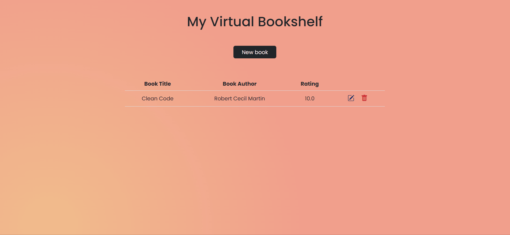

    <h1 >Virtual Bookshelf</h1>
    

        
    

     
    
A simple virtual bookshelf to practice CRUD with SQLite and SQLAlchemy.

## Tools used

    
    
    
    
    
    
    
    
    

## License

This project is under license from [MIT](LICENSE).
